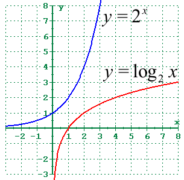
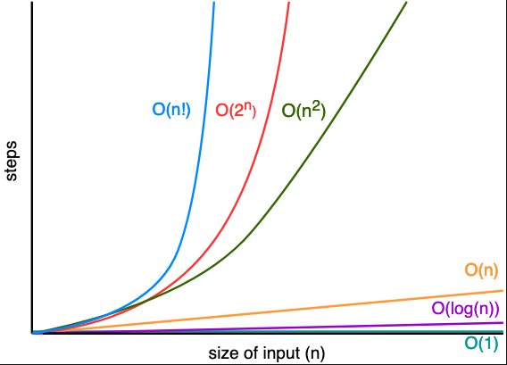

# Algebra

## Logarithms

A logarithm is the inverse function of an exponentiation. So:

`log``b``x = y`&nbsp;&nbsp;if&nbsp;&nbsp;`b``y`` = x`

For example:

`log``2``64 = 6`&nbsp;&nbsp;as&nbsp;&nbsp;`2``6`` = 64`

In other words, the `log` base `2` of `64` is the number to which you have to raise `2` to get `64`.

_Graph of log base 2. Note that the graph is the mirror image of the inverse exponentiation._

_Big O rates of growth. Logarithms are useful in computer science, where they are used to measure time complexity of algorithms. This graph gives a sense of how quickly the results of functions grow, as their inputs grow._
