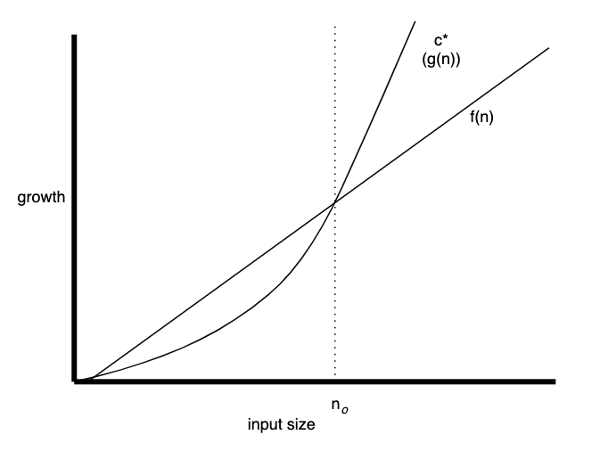
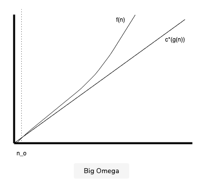
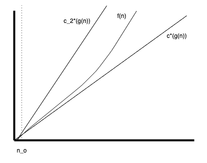

# Complexity Measures

## Asymptotic Notations

### Big O

A function `f(n)` is considered `O(g(n))`, if there exists some positive real constant `c` and an integer `n`<sub>`0`</sub>​` > 0`, such that the following inequality holds for all `n`<sub>`0`</sub>` ≥ n`.



### Overview

| Function                  | Name         |
| ------------------------- | ------------ |
| 1. Any constant           | Constant     |
| 2. `nlogn`                | Logarithmic  |
| 3. `log`<sup>`2`</sup>`n` | Log-square   |
| 4. `√n​​`                 | Root-n       |
| 5. `n​​`                  | Linear       |
| 6. `nlogn​​`              | Linearithmic |
| 7. `n`<sup>`2`</sup>      | Quadratic    |
| 9. `n`<sup>`3`</sup>      | Quartic      |
| 8. `n`<sup>`4`</sup>      | Cubic        |
| 10. `2`<sup>`n`</sup>     | Exponential  |
| 11. `e`<sup>`n`</sup>     | Exponential  |
| 11. `n!`                  | n-Factorial  |


### Big Omega

A function `f(n)` is in `Ω(g(n))` if there exists a real constant `c > 0` and there exists `n`<sub>`o`</sub>` > 0` such that `f(n) >= cg(n)` for `n >= no`.

In other words, _for sufficiently large values of `n`, `f(n)` will grow at least as fast as `g(n)`_.



### Big Theta

If `f(n)` is in `O(g(n))` and `f(n)` is also in `Ω(g(n))` then it is in `Θ(n)`. When a running time is `Θ(g(n))`, the running time is at least `c`<sub>`1`</sub>`g(n)` and at most `c`<sub>`2`</sub>`g(n)`.

In other words, `f(n)` will never be overtaken by `c(g(n))` or overtake `c`<sub>`2`</sub>`(g(n))`.

**Questions:**

n^2 ∈ Θ(n^3)?
False (because n^3 will overtake n^2)

n^2 ∈ Θ(n^2)?
True (because >= and <=)

n^2 ∈ Θ(n)
False (because n^2 will overtake n)



## Common Complexity Scenarios

### Simple for-loop with increment of 1

```
for (var x = 0; x < n; x++) {
    //statement(s) that take constant time
}
```

Running time complexity: `O(n)`

### For-loop with increment of k

```
for (var x = 0; x < n; x+=k) {
    //statement(s) that take constant time
}
```

Running time complexity: `O(n)`

### Simple nested for-loop

```
for (var=0; i<n; i++){
    for (var=0; j<m; j++){
        //Statement(s) that take(s) constant time
    }
}
```

Running time complexity: `O(nm)`

### Nested For-loop with dependent variables

```
for (var i=0; i<n; i++){
    for (var j=0; j<i; j++){
        //Statement(s) that take(s) constant time
    }
}
```

Running-time complexity: `O(n`<sup>`2`</sup>`)`

### Nested For-loop with Index Modification

Hard one!

```
for (var i=0; i<n; i++){
    i*=2;
    for (var j=0; j<i; j++){
        // Statement(s) that take(s) constant time
    }
}
```

Running time complexity: `O(n)`

### Loops with log(n) time complexity

```
i = //constant
n = //constant
k = //constant
while (i < n){
    i*=k;
    // Statement(s) that take(s) constant time
}
```

Running time complexity: `O(log`<sub>`k`</sub>`(n))`
