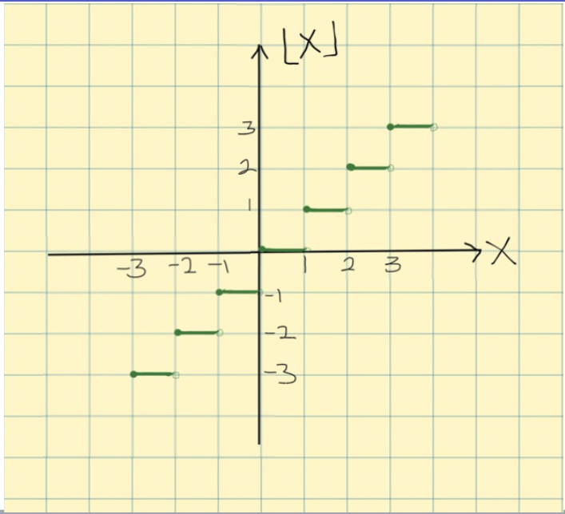
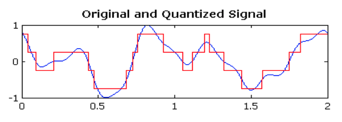
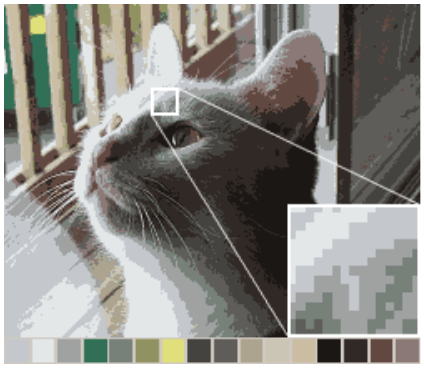

# Table of Contents

1. [Boolean Logic](#boolean-logic)
2. [Integer Functions](#integer-functions)
3. [Sequences](#sequences)
4. [Sets and Ordering](#sets-and-ordering)
5. [Sums](#sums)
6. [Number Theory](#number-theory)
7. [Graph Theory](#graph-theory)
8. [Probability](#probability)
9. [Asymptotics](#asymptotics)

# Boolean Logic

## Definitions

- **proposition**: a statement with a true/false value
  - represented by values `p` and `q`
  - true is `T` or `1`, false is `F` or `0`
- **negation**: `¬p` == NOT `p`
- **conjunction**: `p ∧ q` == `p` AND `q`
- **disjunction**: `p ∨ q` == `p` OR `q`
- **implication**: `p -> q` == IF `p` THEN `q` (functionally, the complement to conjunction)
- **exclusive or**: aka `XOR` is a connective commonly used in circuits. True when only one or the other is true.

| p   | q   | p ∧ q | p ∨ q | p -> q | p ⊕ q |
| --- | --- | ----- | ----- | ------ | ----- |
| T   | T   | T     | T     | T      | F     |
| T   | F   | F     | F     | F      | T     |
| F   | T   | F     | T     | T      | T     |
| F   | F   | F     | F     | T      | F     |

A **truth table** (like above) compare boolean values for various expressions.

# Integer Functions

A **function** is a mapping from one set to another set. Usually described by a **rule** or a **graph**.

The **floor** of `x` is the greatest integer less than `x`:

```
floor(x) or ⌊x⌋
```



The **ceiling** is least integer greater than `x`:

```
ceiling(x) or ⌈x⌉
```

The **integer part** is equal to the floor.

```
int(x) or [x]
```

The **fractional part** is the non-integer part. It is calculated by subtracting the floor from the number.

```
frac(x) or {x} = x − ⌊x⌋
```

<blockquote>
Note: The results for negative numbers can be unintuitive. For example:
frac(-5.25) = −5.25 − ⎣ -5.25 ⎦ = -5.25 + 6 = .75
</blockquote>

Rounding functions like floor and ceiling are used in **quantization**, where continuous values are converted into discrete values.




# Sequences

A sequence:

- Has **elements**, **terms**, or **members**
- Can be infinite or finite
- `a`<sub>`n`</sub> represents the nth term (can be zero-indexed)
- Can be represented with a function, for example:
  - `a`<sub>`n`</sub>` = 5n + 1` for `1, 6, 11, 16`
  - `a`<sub>`n`</sub>` = 2n`<sup>`2`</sup> ` + 1` for `3, 5, 9, 17, 33`

## Recursion

A sequence can also be represented recursively. For example, the above sequence `1, 6, 11, 16` can be represented thus:

`a`<sub>`n`</sub> = `a`<sub>`n - 1`</sub>` + 5`

## Arithmetic vs. Geometric

An arithmetic progression grows by addition.

- Recursive: `a`<sub>`n`</sub>` = a`<sub>`n - 1`</sub>` + d`
- Formula: `a`<sub>`n`</sub>` = a`<sub>`0`</sub>` + nd`

By contrast, a geometric progression grows by multiplication.

`a`<sub>`n`</sub>` = a`<sub>`n - 1`</sub>` × r = a`<sub>`0`</sub>` × r`<sup>`n`</sup>

# Sets and Ordering

A **set** is a collection of distinct objects.

```
S = { 3, 4, 5 }
3 ∈ S
6 ∉ S
```

A rule can also be used to represent a set:

```
S = { x | x ∈ Z, 3 ≤ x ≤ 5 } = { 3, 4, 5 }
```

The size of a set is the number of elements it contains:

```
| S | = 3
```

A **subset** is a portion of a set:

```
A = { 3, 4 }
A ⊂ S
```

The **power set** of `S` or `P(S)` is the set of all subsets of `S`. Its size is `2`<sup>`n`</sup> where n is number of elements.

```
S = { a, b }
P(S) = { Ø, { a }, { b }, { a, b } }
| P(S) | = 2^n = 4
```

| Symbol | Meaning            |
| ------ | ------------------ |
| ∈      | is a member of     |
| ∉      | is not a member of |

# Sums

# Number Theory

# Graph Theory

# Probability

# Asymptotics
