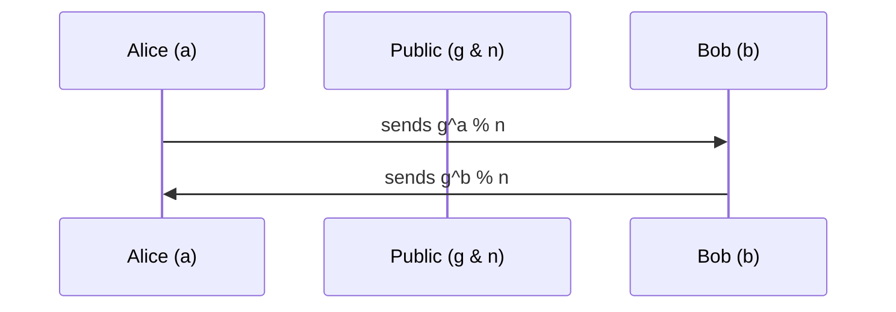

# Security

## Public Key Cryptography

In its original conception, cryptography was **symmetric**. Both parties own a copy of the same key, which both _encrypts_ and _decrypts_.

Public key cryptography takes that a step further and makes encryption **asymmetric**. Keys come in pairs: one key encrypts, and the second key decrypts.

In practice, you have a public key and a private key. Your **public key** is just that -- public. You publish it widely, wherever you like. The **private key** is private -- you don't share it with anyone.

- When someone wants to send you a message... they encrypt it with your **public key**, knowing that only you will be able to decrypt it (using your corresponding **private key**).
- When you want to send someone else a message... you encrypt it with your **private key**. Although anyone can decrypt this message using your private key, it is guaranteed to be an authentic message originating from you.

### Questions

- Explain how public key encryption works, and how it differs from symmetric encryption.

### References

- [Computerphile - Public Key Cryptography](https://www.youtube.com/watch?v=GSIDS_lvRv4)

## Secret Key Exchange (Diffie-Hellman Exchange)

This happens at the outset of just about every new internet communication. Essentially, both parties have a private value (`a` and `b`). Each party performs a calculation using their private value and the two publicly available values (`g` & `n`). They exchange their calculated values, and run the same operation with their private values. The end result is that both parties have calculated the same value (`g``a*b`` % n` == `g``b*a`` % n`). That value cannot be calculated by the numbers that have been exposed in the public space (`g`, `n`, `g``a`` % n` or `g``b`` % n`).

- `a` is a number known only to Alice
- `b` is a number known only to Bob
- `p` is a small prime number, publicly known
- `n` is a very large number, publicly known (2000 or 4000 bits)

The simple one-way operation that makes this process viable is the `modulo`. Modulo calculates the remainder after division. The remainder is calculated from the dividend, but dividend _can't_ be calculated from the remainder.

### Questions

- Outline the Diffie Hellman secret-key exchange.

### References

- [Computerphile - Secret Key Exchange (Diffie-Hellman)](https://www.youtube.com/watch?v=NmM9HA2MQGI)
- [Computerphile - Diffie-Hellman - The Mathematics Bit](https://www.youtube.com/watch?v=Yjrfm_oRO0w)
